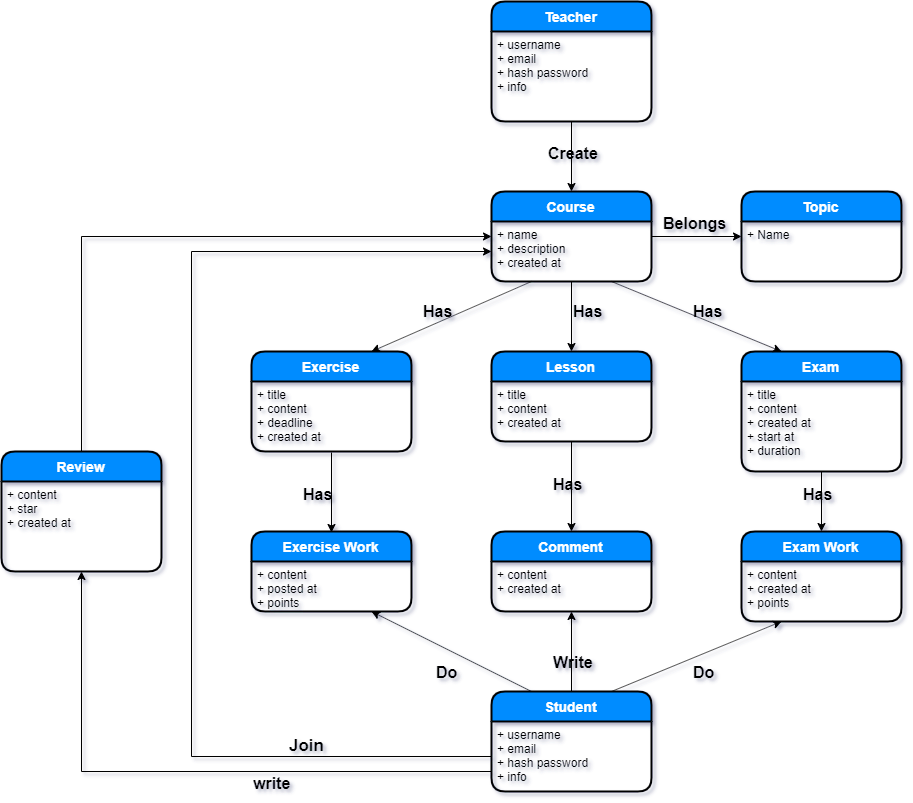

# **Lược đồ cơ sở dữ liệu**

## Truy vấn

- **Đăng ký**:
  - Kiểm tra tính hợp lê của email và username (bao gồm việc kiểm tra trùng lặp)
  - Tạo tài khoản với username, email và password nếu email và username không trùng lặp
- **Đăng nhập**:
  - Tìm kiếm tài khoản có username và password như dữ liệu nhận được từ request
- **Tìm kiếm và xem thông tin khóa học**
  - Tìm kiếm khóa học dụa theo các tiêu chí: _tên khóa học_, _chủ đề khóa học_.
  - Lấy thông tin khóa học, bao gồm:
    - Tên khóa học
    - Chủ đề
    - Giảng viên
    - Số lượng học viên
    - Điểm đánh giá
    - Khóa học kín/công khai
    - Khóa học đã đóng/đang hoạt động
    - Số lượng bài giảng
- **Tìm kiếm và xem thông tin người dùng**
  - Tìm kiếm người dùng dựa theo tiêu chí: _tên người dùng_.
  - Lấy thông tin người dùng, bao gồm:
    - Username
    - Email
    - Ảnh đại diện
    - Là giảng viên hay học viên
    - Số lượng khóa học đã tạo (nếu là giảng viên)
    - Số lượng khóa học đã và đang tham gia (nếu là học viên)
- **Sửa thông tin tài khoản**
  - Sửa mật khẩu
    - Kiểm tra mật khẩu cũ
    - Kiểm tra mật khẩu mới có trùng lặp không
    - Cập nhật mật khẩu mới
  - Sửa email, username:
    - Kiểm tra tính hợp lệ, tính duy nhất
  - Sửa thông tin khác
- **Tạo khóa học**
  - Thông tin về khóa học mới bao gồm:
    - Tên khóa học
    - Chủ đề
    - Khóa học công khai hay kín
    - Ngày tạo
- **Sửa thông tin khóa học**
  - Sửa tên, chủ đề, mô tả của khóa học
- **Đăng bài học**
  - Thông tin về bài học bao gồm:
    - Khóa học
    - Tiêu đề bài học
    - Nội dung bài học
- **Đăng bài tập**
  - Thông tin về bài tập bao gồm:
    - Thuộc bài học nào
    - Tiêu đề bài tập
    - Nội dung, yêu cầu của bài tập
    - Hạn nộp bài (tùy chọn)
- **Tạo bài kiểm tra**
  - Một bài kiểm tra(trắc nghiệm) bao gồm các câu hỏi, mỗi câu hỏi có nhiều lựa chọn và chỉ 1 đáp án
- **Thống kê bài tập**
  - Thống kê bài tập bao gồm:
    - Danh sách các học viên
    - Trạng thái bài tập: đã nộp(muộn/sớm)/chưa nộp
    - Link đến bài làm của học viên
- **Thống kê bài kiểm tra**
  - Thống kê bài kiểm tra bao gồm:
    - Danh sách các học viên
    - Điểm kiểm tra (số câu trả lời đúng/tổng số câu hỏi)
    - Link đến bài làm của học viên
- **Xử lý yêu cầu tham gia khóa học**
  - Chấp nhận yêu cầu: Thêm vào danh sách học viên của khóa học, xóa khỏi danh sách yêu cầu
  - Từ chối yêu cầu: Xóa khỏi danh sách yêu cầu
- **Xóa học viên**
  - Xóa học viên khỏi danh sách học viên của khóa học
- **Tham gia khóa học**
  - Gửi yêu cầu tham gia đến khóa học
- **Bình luận về bài học**
  - Thông tin về bình luận bao gồm:
    - Người bình luận
    - Nội dung bình luận
    - Thời điểm bình luận
- **Nộp bài tập**
  - Thông tin về bài tập bao gồm:
    - Học viên
    - Nội dung bài tập
    - Thời điểm nộp
- **Nộp bài kiểm tra**
  - Bài làm bao gồm:
    - Câu hỏi
    - Câu trả lời
    - Điểm
- **Rời khóa học**
  - Xóa khỏi danh sách học viên của khóa học

- **Profile**
  - Thông tin cơ bản:
    - Username
    - Email
    - Ảnh đại diện
    - Giảng viên/Học viên
  - Nếu là giảng viên:
    - Danh sách các khóa học đã tạo
  - Nếu là học viên:
    - Danh sách các khóa học đã tham gia
- **Chi tiết khóa học**
  - Danh sách học viên
  - Danh sách các bài học
  - Danh sách bài tập
  - Danh sách yêu cầu tham gia
  - Danh sách bài kiểm tra

## Xác định thực thể

- Topic
- Course
- User
- Review
- Join Request
- Lesson
- Comment
- Exercise
- Exercise Work
- Exam
- Exam Work

## Quan hệ giữa các thực thể

## Lược đồ cơ sở dữ liệu

[CQL script](./lms.cql)

